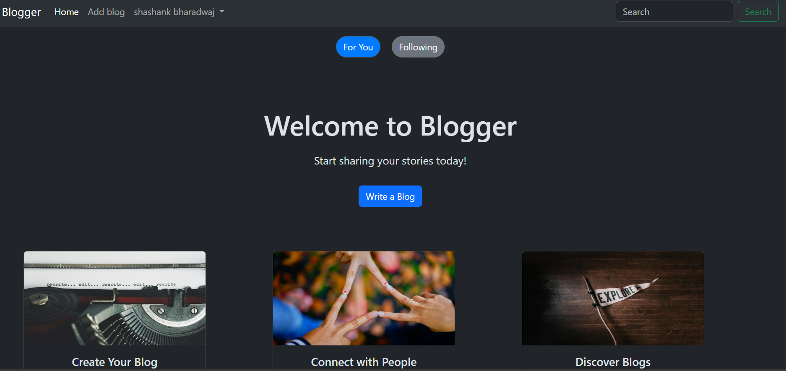
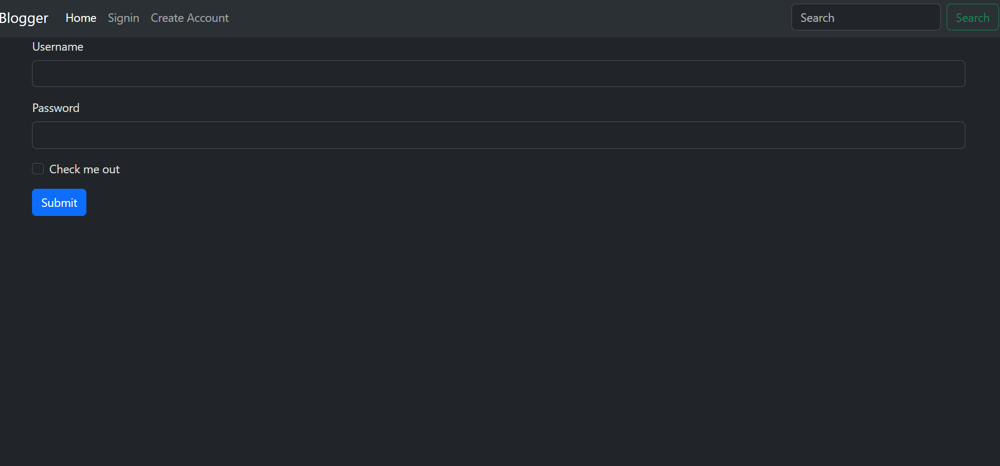
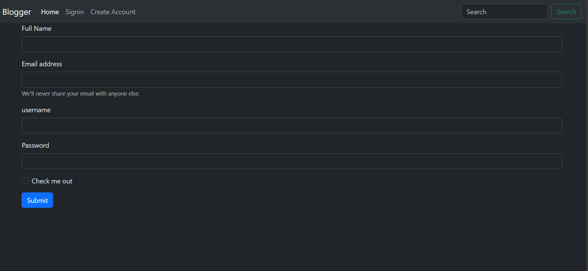
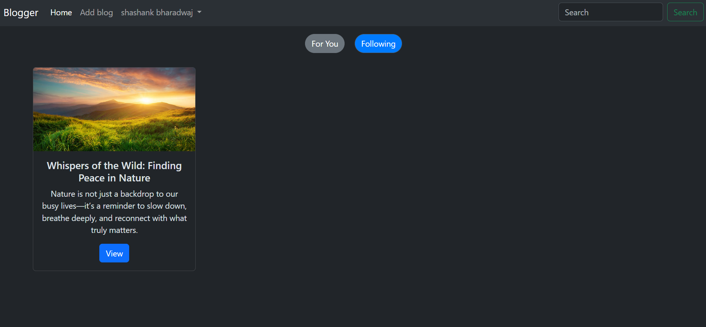
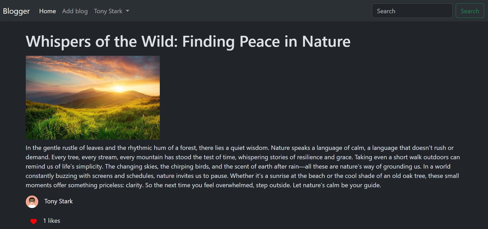
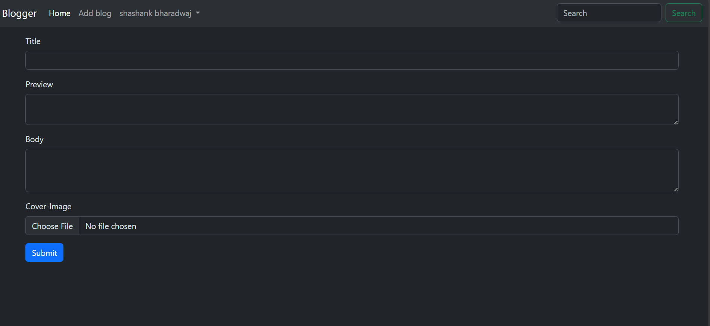
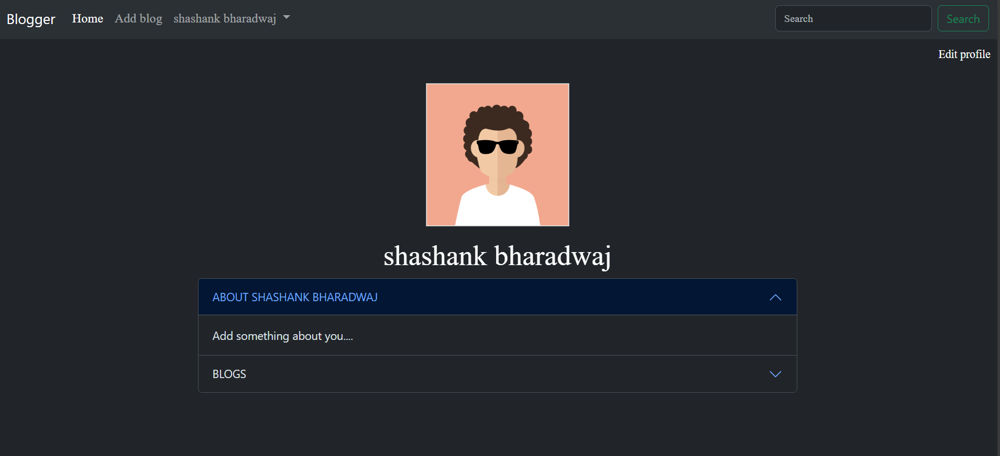

# Blogger

A full-featured blogging platform built with Node.js, Express, MongoDB, and EJS, following the MVC (Model-View-Controller) architecture. Blogger allows users to create, read, update, and delete blog posts, manage their profiles, follow people, and interact with a dynamic community.

---

## 🚀 Features

- User Authentication (signup, login, session management)
- Create, Read, Update, and Delete (CRUD) blog posts
- Comment on posts
- Search for people
- Search and filter blogs
- Responsive UI with EJS templates
- Secure route handling and user management
- MVC project structure for maintainability

---

## 🖼️ Screenshots

### Home Page


### Sign-in Page


### Create Account


### Activity Page


### Blog Page


### Add Blog Page


### Profile Page


---

## 🗂️ Project Structure
```plaintext
Blogger/
├── app.js
│   └── Main application entry point
├── controllers/
│   └── Business logic (blog, user, etc.)
├── middlewares/
│   └── Custom middlewares (authentication, etc.)
├── models/
│   └── MongoDB schemas with Mongoose
├── routes/
│   └── Express route definitions
├── services/
│   └── Utility functions
├── views/
│   └── EJS templates for UI
├── public/
│   └── Static assets (CSS, JS, images)
├── screenshots/
│   └── Screenshots for documentation
├── .env
│   └── Environment variables
└── package.json
    └── Project metadata and dependencies

---

## 💻 Usage

- **Register/Login**: Create an account or log in to start posting blogs.
- **Create Post**: Write and publish your own blog posts.
- **Edit/Delete Post**: Manage your posts with easy edit and delete options.
- **Comment**: Engage with the community by commenting on posts.
- **Logout**: Securely log out of your account.
